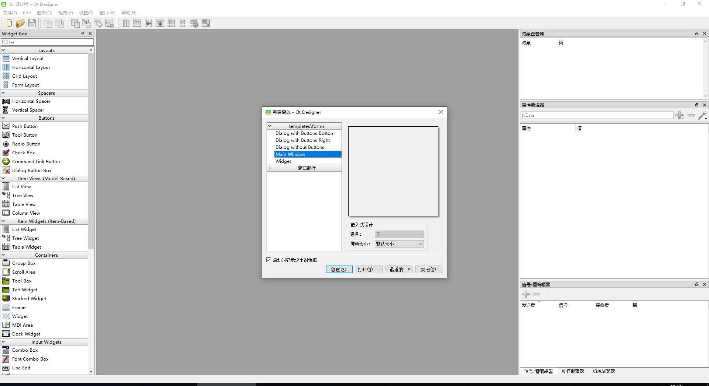
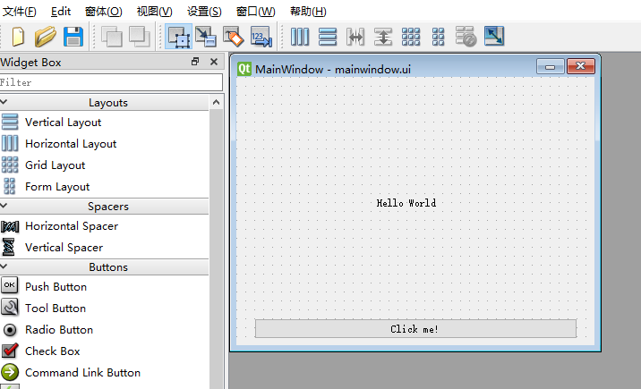

#高效绘制用户界面  
刚一开始使用Qt，大家基本上都是直接在代码里设置控件类，大小，位置。这样虽然繁琐，但是更可以让大家熟悉各
个控件的属性和方法。为了高效的绘制界面，这里介绍一种使用QtDesigner结合PySide的编程方法。主要分为三个步骤：
1. 打开QtDesigner绘制窗口；
2. 将UI文件转换为py文件供主程序调用；
3. 主窗口全局初始化。
## 1.绘制窗口  
使用过C++版本Qt的老玩家（用户）都知道，QtDesigner是一个非常好用的窗口绘制工具。我们使用PySide编程，难道还需要
安装Qt？答案是不用。Qt团队在PySide的安装包里已经为我们准备好了QtDesigner。  
找到你的python安装目录，打开Python\Lib\site-packages\PySide2\designer.exe，这便是QtDesigner。为了打开方便，
你可以设置快捷方式。作者使用PyCharm编程，直接将该程序添加到了工具里。界面如下图：  

## 2.文件转换  
打开QtDesigner后，新建一个空白的主窗口文件，按照Lesson_1显示的窗口的样子放置一个Label和一个pushButton，
并设置好大小等属性，保存在当前工程目录下。（选择目录很重要，很多人
找不到文件，原因就是自己保存时马马虎虎，还抱怨什么**电脑）  

然后打开命令行，切换工作路径到当前工程目录下，输入：  
*pyside2-uic [你保存的文件名].ui > ui_mainwindow.py*  
注意文件名，可以修改，但切记与后面主文件调用的文件名要一致。毕竟很多人写代码只用三个键。此时，你可以打开生
成的py文件查看，很详细的记录了窗口的各种属性。   
```
# 生成.py文件中部分关键代码
class Ui_MainWindow(object):
    def setupUi(self, MainWindow):
        MainWindow.setObjectName("MainWindow")
```
## 3.调用显示窗口  
首先，把生成的py文件中的窗口类import进来，把QMainWindow类也import进来。然后定义主窗口，代码如下;   
```
# 从生成的.py文件导入定义的窗口类
from ui_mainwindow import Ui_MainWindow

# 定义主窗体
class MainWindow(QMainWindow):
    def __init__(self):
        super(MainWindow, self).__init__()
        self.ui = Ui_MainWindow()
        self.ui.setupUi(self)
```
代码很简单，切记文件名和类名要对应。其他简单的功能实现部分相差不多，具体请参照main.py。
到此，使用PySide创建用户界面的基本流程你都学会了。但是你会发现，这样生成的窗口很不美观，并且拖动大小后，
内部控件没有变化，和Lesson_1显示截然的不同，显得很不自然。想要更好的设置界面，请看下一课。